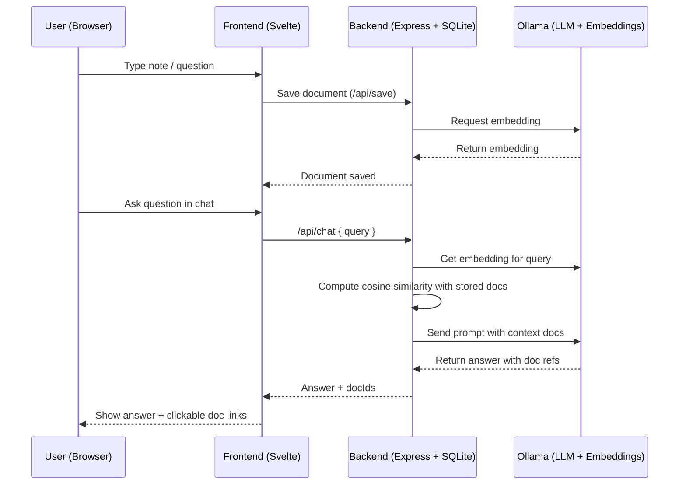

# 📓 Svelte Markdown Embeddings App

A note-taking web app built with **Svelte 4** that lets you:

* Create, edit, and preview **Markdown** documents side-by-side.
* Store documents with **vector embeddings** for semantic search.
* Chat with your notes using **Ollama** (local LLM backend).
* Get **inline document references** in AI answers (clickable to open the doc in editor/preview).
* Switch between **light/dark mode** with proper Prism.js syntax highlighting.
* Adjustable **split layout** between editor/preview and AI chat.

---

## 🚀 Features

* **File list panel** with tabbed views: *All Files* and *Search Results*.
* **Document editor panel** with live Markdown preview.
* **Dirty state indicator** shows when unsaved changes exist.
* **AI chat panel**:

  * Powered by Ollama.
  * Uses **embeddings** for document retrieval.
  * Returns both **answer text** and **document references** (title + ID).
  * Click doc links to open directly in editor.
* **Dark mode toggle**:

  * Applies to entire app.
  * Dynamically swaps Prism.js themes for syntax highlighting.
* **Resizable editor/chat split** with drag handle, state saved to localStorage.

---

## 🖥️ Frontend Fields

* **File List Panel**

  * Tabs:

    * **All Files**: all documents.
    * **Search Results**: filtered docs from vector search.
* **Document Fields**

  * **Document Title** → plain text input, bound to doc title.
  * **Document Edit Pane** → `<textarea>` where you type Markdown.
  * **Document Preview Pane** → rendered Markdown with Prism.js highlighting.
* **Indicators**

  * **Dirty State** → shows when edits exist but aren’t saved.
* **AI Chat**

  * Input field → type your question.
  * History → user messages + assistant responses with inline doc refs.

---

## 🖥️ Backend API Reference

### Health Check

```
GET /api/health
```

Returns `{ ok: true }` if the API is running.

---

### Save Document

```
POST /api/save
```

**Body:**

```json
{
  "title": "My Note",
  "content": "Some markdown text..."
}
```

Returns:

```json
{
  "id": 1,
  "lastModified": "2025-09-20T15:25:31.123Z"
}
```

---

### List Documents

```
GET /api/docs
```

Returns array of docs (no content):

```json
[
  { "id": 1, "title": "My Note", "lastModified": "2025-09-20T15:25:31.123Z" }
]
```

---

### Get Document by ID

```
GET /api/doc/:id
```

Returns full document:

```json
{
  "id": 1,
  "title": "My Note",
  "content": "Some markdown text...",
  "lastModified": "2025-09-20T15:25:31.123Z"
}
```

---

### Delete Document

```
DELETE /api/doc/:id
```

Returns:

```json
{ "success": true }
```

---

### Semantic Search

```
POST /api/search
```

**Body:**

```json
{ "query": "find razor svelte", "topK": 5 }
```

Returns:

```json
[
  {
    "id": 1,
    "title": "My Note",
    "lastModified": "2025-09-20T15:25:31.123Z",
    "score": 0.82
  }
]
```

---

### Chat with Documents

```
POST /api/chat
```

**Body:**

```json
{ "query": "What are the benefits of RazorSvelte?", "topK": 3 }
```

Returns:

```json
{
  "answer": "Here’s an explanation ... <<DOC_ID:1 TITLE:My Note SCORE:0.82>>content<</DOC_ID>>",
  "docIds": [
    { "id": 1, "title": "My Note", "score": 0.82 }
  ]
}
```

---

## 📦 Requirements

### 1. Ollama

You need **Ollama** running locally.
👉 [Install Ollama](https://ollama.ai)

### 2. Ollama Models

* **Embedding Model (default: `nomic-embed-text`)**
  👉 [Get nomic-embed-text](https://ollama.ai/library/nomic-embed-text)

* **Chat Model (default: `llama3.2`)**
  👉 [Get llama3.2](https://ollama.ai/library/llama3.2)

Run these commands after installing Ollama:

```bash
ollama pull nomic-embed-text
ollama pull llama3.2
```

---

## 📦 Dependencies

### Backend (Node.js)

* `better-sqlite3`
* `express`
* `axios`
* `cors`
* `dotenv`

### Frontend (Svelte)

* `svelte` (v4)
* `marked`
* `marked-highlight`
* `prismjs`
* `bootstrap`

---

## ⚙️ Install & Run

### Clone the repo

```bash
git clone https://github.com/wergeld/svelte-markdown-embeddings.git
cd svelte-markdown-embeddings
```

### Backend

```bash
cd backend
npm install
npm run dev   # or node server.mjs
```

### Frontend

```bash
cd frontend
npm install
npm run dev
```

Open browser at listed port on localhost

---

## 📊 System Flow

Here’s how everything connects:



---

## 🗄️ Database Schema

### Table Definition

```sql
CREATE TABLE documents (
    id INTEGER PRIMARY KEY AUTOINCREMENT,
    title TEXT NOT NULL,
    content TEXT NOT NULL,
    embedding TEXT NOT NULL,
    lastModified TEXT NOT NULL
);
```

### Columns

* **id** → unique doc identifier
* **title** → document title
* **content** → raw markdown text
* **embedding** → vector embedding stored as **JSON text**

  * Example:

    ```json
    [0.0135, -0.0279, 0.0042, ...]
    ```
  * Format: array of floats (`float32` values from Ollama, serialized as JSON string).
* **lastModified** → ISO8601 string (`2025-09-20T18:55:33.123Z`)

---

## 🔄 Migration Note: JSON → BLOB for Embeddings

Currently, embeddings are stored as **JSON strings**.
This is simple, but inefficient for large collections because:

* JSON storage is larger on disk.
* Each query requires `JSON.parse`.
* No type enforcement (all text).

### Suggested Migration

Switch to **binary BLOB storage** (raw Float32Array).

### Schema Change

```sql
ALTER TABLE documents RENAME TO documents_old;

CREATE TABLE documents (
    id INTEGER PRIMARY KEY AUTOINCREMENT,
    title TEXT NOT NULL,
    content TEXT NOT NULL,
    embedding BLOB NOT NULL,
    lastModified TEXT NOT NULL
);
```

### Migration Script

1. Read JSON embeddings from `documents_old`.
2. Convert to `Float32Array`.
3. Insert into new `documents` table as a `BLOB`.

Example in Node.js:

```js
const oldDocs = db.prepare("SELECT * FROM documents_old").all();
const insert = db.prepare("INSERT INTO documents (id, title, content, embedding, lastModified) VALUES (?, ?, ?, ?, ?)");

for (const d of oldDocs) {
  const arr = JSON.parse(d.embedding);
  const buf = Buffer.from(new Float32Array(arr).buffer);
  insert.run(d.id, d.title, d.content, buf, d.lastModified);
}
```

### Retrieval

```js
const row = db.prepare("SELECT embedding FROM documents WHERE id = ?").get(1);
const floatArray = new Float32Array(row.embedding.buffer, row.embedding.byteOffset, row.embedding.byteLength / 4);
```

✅ Benefits:

* Smaller DB size.
* Faster search (no `JSON.parse`).
* Easier integration with ANN libraries if scaling up.

---

## 🔄 Migration Note: JSON → BLOB for Embeddings

Currently, embeddings are stored as **JSON strings**.
This is simple, but inefficient for large collections because:

* JSON storage is larger on disk.
* Each query requires `JSON.parse`.
* No type enforcement (all text).

### Suggested Migration

Switch to **binary BLOB storage** (raw Float32Array).

### Schema Change

```sql
ALTER TABLE documents RENAME TO documents_old;

CREATE TABLE documents (
    id INTEGER PRIMARY KEY AUTOINCREMENT,
    title TEXT NOT NULL,
    content TEXT NOT NULL,
    embedding BLOB NOT NULL,
    lastModified TEXT NOT NULL
);
```

### Migration Script

```js
const oldDocs = db.prepare("SELECT * FROM documents_old").all();
const insert = db.prepare("INSERT INTO documents (id, title, content, embedding, lastModified) VALUES (?, ?, ?, ?, ?)");

for (const d of oldDocs) {
  const arr = JSON.parse(d.embedding);
  const buf = Buffer.from(new Float32Array(arr).buffer);
  insert.run(d.id, d.title, d.content, buf, d.lastModified);
}
```

### Retrieval

```js
const row = db.prepare("SELECT embedding FROM documents WHERE id = ?").get(1);
const floatArray = new Float32Array(row.embedding.buffer, row.embedding.byteOffset, row.embedding.byteLength / 4);
```

---

### 📊 Performance Comparison

| Aspect                | JSON (current)                                  | BLOB (proposed)                                |
| --------------------- | ----------------------------------------------- | ---------------------------------------------- |
| **Storage Size**      | Larger (array serialized as text)               | Smaller (compact float32 binary)               |
| **Insert Speed**      | Slower (serialize with `JSON.stringify`)        | Faster (direct Float32Array → Buffer)          |
| **Read Speed**        | Slower (parse with `JSON.parse`)                | Faster (direct memory view via `Float32Array`) |
| **Similarity Search** | Requires `JSON.parse` per row before compute    | Direct numeric ops on binary data              |
| **Cross-Language**    | Easy (JSON is universally supported)            | Harder (requires decoding binary format)       |
| **Debuggability**     | Easy (open DB, embeddings are human-readable)   | Hard (binary blobs unreadable in SQLite GUI)   |
| **Scalability**       | Limited (parsing overhead dominates >100k docs) | Better suited for large collections (>1M docs) |

---

✅ Recommendation:

* Keep **JSON** for simplicity in small projects (<5k docs).
* Switch to **BLOB** if storing **tens of thousands of docs** or scaling search speed.

---
